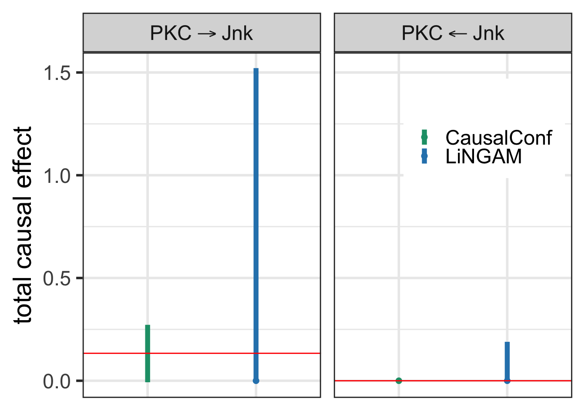

<!-- README.md is generated from README.Rmd. Please edit that file -->

`CausalConf` : Confidence Intervals of Causal Effects under Structure
Uncertainty

Constructs confidence intervals for total causal effects based on
observational data alone when the underlying causal structure is
unknown. Captures both types of uncertainty, uncertainty regarding the
causal structure resulting from a data-driven model selection, and
uncertainty about the numerical size of the effect. Assumes linear
structural equation models with partially homoscedastic Gaussian errors
to ensure identifiability. For details, see D. Strieder and M. Drton,
Identifying Total Causal Effects in Linear Models under Partial
Homoscedasticity
(<https://proceedings.mlr.press/v246/strieder24a.html>).

The following functions are implemented:

- `confDualLRTpartial` : Main function that computes a confidence
  interval for the total causal effect
- `intervalsDualLRTpartial` : Helper function that calculates the bounds
  of the confidence interval
- `orderDualLRTpartial` : Helper function that tests if a causal
  ordering is plausible

### Installation

``` r
devtools::install_github("DavidStrieder/CausalConf")
```

### Usage

Small example using the frequently studied protein expression data
(Sachs et al., Causal protein-signaling networks derived from
multiparameter single-cell data). We are interested in the causal effect
of PKC on Jnk (and vice versa), and we will compare the results to
bootstrapping causal discovery algorithms (LiNGAM) as a benchmark.

To showcase the standard usage of confDualLRTpartial, I’ll keep the code
straightforward and transparent, avoiding custom helper functions or
wrappers.

``` r
library(CausalConf)

# For comparison
library(boot)
library(pcalg)

# For plotting
library(ggplot2)
library(dplyr)

# Load data
data <- read.csv("Example/cd3cd28_aktinhib_residuals.csv")

# Reorder data
dataPKCJnk <- data[c("PKC", "Jnk", setdiff(names(data), c("PKC", "Jnk")))]
dataJnkPKC <- data[c("Jnk", "PKC", setdiff(names(data), c("Jnk", "PKC")))]

# Run confDualLRTpartial
intervalPKCJnk   <- confDualLRTpartial(dataPKCJnk, alpha = 0.05)
intervalJnkPKC   <- confDualLRTpartial(dataJnkPKC, alpha = 0.05)

# True causal effects (based on ground truth DAG as reported by Sachs et al.)
trueeffects <- c(coef(lm(Jnk ~ PKC + Plcg + PIP2 - 1, data))[1], 0)

# Show results

# Covers true effect from PKC to Jnk
intervalPKCJnk
## [1]  0.000000000 -0.007305013  0.272200955
trueeffects[1]
##       PKC 
## 0.1336362

# Correctly decides on no causal effect from Jnk to PKC
intervalJnkPKC
## [1] TRUE   NA   NA
trueeffects[2]
##   
## 0


# Bootstrap LiNGAM intervals as comparison
bootfctlingam <- function(data, indices) {
  B <- pcalg::lingam(data[indices, ])$B
  d <- ncol(data)
  solve(diag(1, d) - B)[2, 1]
}

lingamPKCJnk  <- boot::boot(dataPKCJnk, bootfctlingam, 100)
lingamJnkPKC  <- boot::boot(dataJnkPKC, bootfctlingam, 100)

intervPKCJnk  <- boot::boot.ci(lingamPKCJnk,  conf = 0.95, type = "perc")$percent[4:5]
intervJnkPKC  <- boot::boot.ci(lingamJnkPKC,  conf = 0.95, type = "perc")$percent[4:5]

intervPKCJnk  <- c(intervPKCJnk[1] <= 0 & intervPKCJnk[2] >= 0, intervPKCJnk)
intervJnkPKC  <- c(intervJnkPKC[1] <= 0 & intervJnkPKC[2] >= 0, intervJnkPKC)

# Combine all intervals
intervals <- list(intervalPKCJnk, intervPKCJnk, intervalJnkPKC, intervJnkPKC)

# Assemble results for plotting
true   <- rep(trueeffects, each = 2)
method <- rep(1:2, 2)
min    <- sapply(intervals, `[`, 2)
max    <- sapply(intervals, `[`, 3)
null   <- ifelse(sapply(intervals, `[`, 1), 0, NA)
target <- rep(1:2, each = 2)

results <- data.frame(true, method, min, max, null, target)

# Label targets for plotting
results <- dplyr::mutate(results, 
  target = factor(target, labels = c(expression("PKC"%->%"Jnk"), expression("PKC"%<-%"Jnk")))
)

# Plot intervals
ggplot(results, aes(x = as.factor(method), color = as.factor(method))) +
  ylab("total causal effect") +
  geom_linerange(aes(ymin = min, ymax = max), linewidth = 2, data = subset(results, !is.na(min) & !is.na(max))) +
  geom_point(aes(y = null), size = 2, data = subset(results, null == 0)) +
  geom_hline(aes(yintercept = true), color = "red") +
  facet_grid(. ~ target, labeller = label_parsed) +
  theme_bw(base_size = 22) +
  scale_colour_manual(
    "", limits = c("1", "2"),
    values = c("#1b9e77", "#2b83ba"),
    labels = c("CausalConf", "LiNGAM")
  ) +
  theme(
    axis.title.x = element_blank(),
    axis.text.x = element_blank(),
    axis.ticks.x = element_blank(),
    legend.key.size = unit(0.5, "cm"),
    legend.position = c(0.82, 0.78)
  )
```


